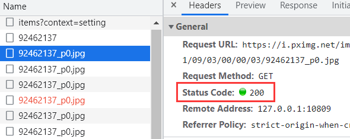
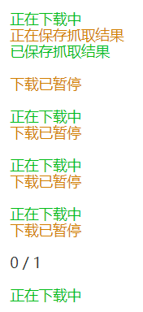
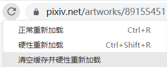
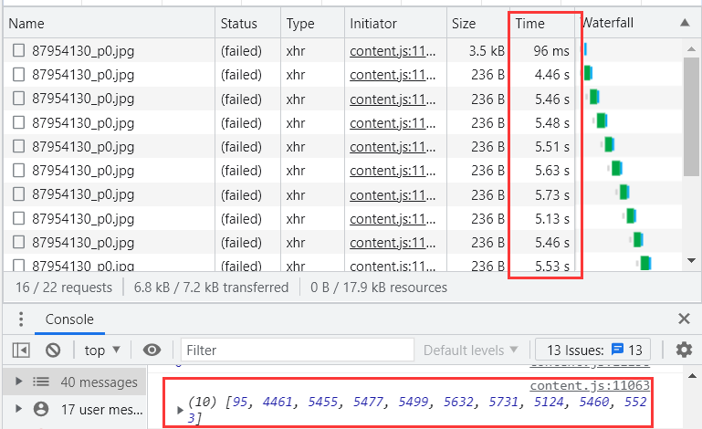
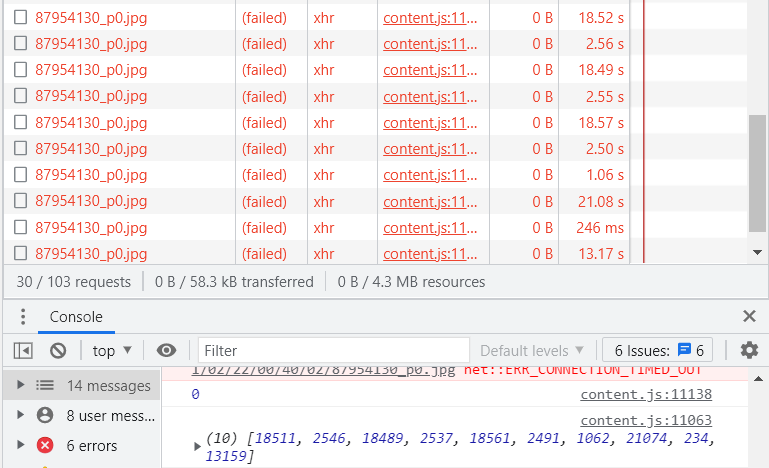

这个问题存在很久了，几乎隔段时间就会有人因为这个问题来问我。用户经常会这样说：

“所有下载进度都是红色的，下载器一直在自动暂停和自动开始下载，网络流量也有正常的下载速度，但就是无法成功下载文件”。

一开始我也不清楚原因，后来 Reinford 搞明白了这是因为系统磁盘剩余空间少导致的。

原因是 Chrome 在处理 XHR 请求时，会把接收到的内容在磁盘里生成一个缓存文件（可能只对体积比较大的请求这样处理）。由于这个文件是在用户文件夹里的 AppData 文件夹里的（也就是在系统所在的磁盘里），当磁盘空间比较少的时候，Chrome 就会让这个请求失败，下载器也就无法下载这个文件了。

- 当系统盘剩余空间低于 2 GiB 左右，就会出现这个问题（至于这个临界值到底是怎么计算的，尚不清楚）。我测试时剩余空间 2.2 GiB 可以正常下载，1.6 GiB 及以下不能正常下载。

- 此时体积大的文件（主要是 7 MiB 以上）都会下载失败，体积小的文件仍然可以下载。

- 这个问题只和系统磁盘有关，和保存图片的磁盘无关。（例我的系统磁盘是 C 盘，而图片保存在 D 盘。只有 C 盘空间不足会发生这个问题。这和 D 盘没有关系）。

## 复现问题

今天的日期是 2021/09/05。我首先向 C 盘内复制大量文件，使其剩余空间为 260 MiB。

然后下载一张比较大的图片，这个作品 [92462137](https://www.pixiv.net/artworks/92462137) 的图片的体积大约是 15 MiB。问题可以复现。

## 问题的表现

查看浏览器 NetWork 里的请求，发现请求的状态码是 `200`，但是请求最终却是失败的。




同时，浏览器的控制台里显示错误信息：

```
GET https://i.pximg.net/img-original/img/2021/09/03/00/00/03/92462137_p0.jpg net::ERR_FAILED 200
```


查看网络状况，发现依然**有正常的下载速度和网络流量**。

## 下载器的表现

在发生这种情况时，下载器发出的 XHR 请求的 `loadend` 事件里的 `xhr.status` 为 `0`。（status 为 `0` 的原因可能是请求的状态被浏览器直接设置为失败）

下载器在下载文件的请求失败时，会把这个文件的进度条变成红色。

下载器会进行重试，在重试结束之前最多会下载 10 次这个文件。如果 10 次之后仍然没有成功下载它，下载器会暂停下载，然后再次开始下载。

因为在这种异常情况里是无法成功下载文件的，所以下载器陷入了无尽的重试流程。**用户会看到下载器在不停的暂停下载、然后继续下载**。



## 解决方法

清理系统磁盘的空间（推测至少需要 2 GiB 以上的剩余空间），然后重新启动浏览器，继续未完成的下载。

在清理磁盘空间之后，建议重新启动浏览器。如果想省事一些，不重新启动浏览器，可以尝试“清空缓存并硬性重新加载”，也有可能会正常下载。



单纯的 F5 刷新是不能正常下载的。

## 检测这种情况

当一次重试达到最大次数（尝试下载了 10 次）时，判断最后一次的 `xhr.status`，如果为 `0` 则有可能是发生了这种情况。

但是 status 为 `0` 也有可能是其他原因，比如请求超时 `net::ERR_CONNECTION_TIMED_OUT`。（测试方法：在文件刚开始下载时，把代理软件的模式设置为“关闭 Http 代理”，之后 Chrome 因为无法连接到 Pixiv 而导致请求超时（最典型的超时时间是 21 秒）。

目前来看，超时的请求花费的时间比较长，所以应该从请求花费的时间上区分是磁盘空间不足还是请求超时。

下载模块保存了每次请求从发起请求到进入重试阶段的时间。

下面是**磁盘空间不足**时花费的时间：



可以看到日志输出的时间与 NetWork 里的时间是一致的。

上图中大部分时间都是 5 秒左右，这是比较典型的情况。并不是所有时候都会这么平均，可能偶尔会有某一个请求花费十几秒，甚至我看到最离谱的花费了 3.5 分钟（最后也还是 200 failed，不是超时）。

下面是**请求超时**的时间：



请求超时的典型特征是：一次花费时间较长的超时请求之后（20 秒左右），它的下一次请求花费的时间很短（0.2 - 2 秒左右）。

下载器现在设置的检查条件是：**在全部的 10 次请求中，如果有 9 次小于 10 秒，就认为是磁盘空间不足。** 这样判断的准确度是比较高的（由于请求超时的时候会有多次 20 秒左右的请求，所以它几乎不可能会被误判为磁盘空间不足）。

当下载器认为磁盘空间不足时，会立刻暂停下载，并且不会再自动重试（避免陷入无限的重试循环）。

同时下载器会在前台显示提示，告诉用户可能存在的问题：

```
下载时出现错误，可能的原因：<br>系统磁盘的剩余空间可能太少。请尝试清理系统磁盘空间，然后重新启动浏览器，继续未完成的下载。
```


